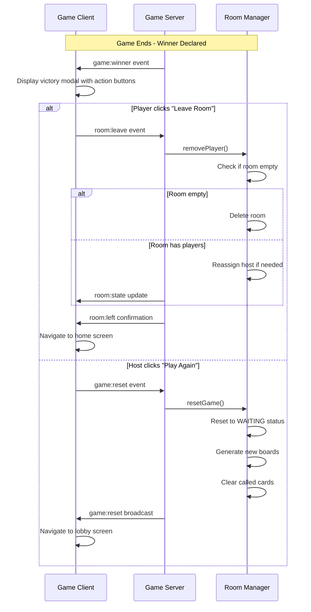

# Design Document: Post-Game Room Exit and Reset

## Overview

This feature adds post-game controls to allow players to leave a completed game room or restart a new game session with the same players. The design integrates seamlessly with the existing Socket.IO event system and room management architecture, adding new client-side UI components and server-side event handlers.

The solution provides two primary actions after game completion:
1. **Leave Room** - Available to all players, disconnects from the room and returns to home screen
2. **Play Again** - Available only to the host, resets the game state and generates new boards for all players

## Architecture

### High-Level Flow



### Component Integration

The feature integrates with existing components:
- **Game.tsx** - Add post-game action buttons and victory modal enhancements
- **socket-handlers.js** - Add new event handlers for `room:leave` and `game:reset`
- **room-manager.js** - Add `resetGame()` method and enhance `removePlayer()` logic
- **socket-events.ts** - Add new event type definitions

## Components and Interfaces

### 1. Client-Side Components

#### Game Component Enhancement

The `Game.tsx` component will be modified to display post-game action buttons when `roomState.status === 'ENDED'`.

**New UI Elements:**
- Victory modal overlay (already exists, will be enhanced)
- Action buttons container below victory message
- "Leave Room" button (all players)
- "Play Again" button (host only)

**Button Styling:**
- Use existing Día de Muertos theme colors
- "Play Again": Primary action button (orange gradient)
- "Leave Room": Secondary action button (gray/white)
- Mobile-responsive with proper spacing

#### Socket Hook Enhancement

The `useSocket.ts` hook will be extended with new event handlers and emit functions:

```typescript
// New emit functions
const leaveRoom = () => {
  socket?.emit('room:leave', { roomCode: currentRoomCode });
};

const resetGame = () => {
  socket?.emit('game:reset', { roomCode: currentRoomCode });
};

// New event listeners
socket.on('room:left', handleRoomLeft);
socket.on('game:reset', handleGameReset);
```

### 2. Server-Side Components

#### New Socket Event Handlers

**Handler: `room:leave`**
- Validates that the room exists
- Calls `roomManager.removePlayer(roomCode, playerId)`
- Emits `room:left` confirmation to the leaving player
- Broadcasts `player:left` to remaining players
- Broadcasts updated `room:state` to remaining players

**Handler: `game:reset`**
- Validates that the room exists
- Validates that the requester is the host
- Validates that the game status is "ENDED"
- Calls `roomManager.resetGame(roomCode, hostId, io)`
- Broadcasts `game:reset` event with updated room state to all players

#### Room Manager Enhancement

**New Method: `resetGame(roomCode, hostId, io)`**

Purpose: Reset a completed game to the waiting state with new boards

Logic:
1. Validate room exists and status is "ENDED"
2. Validate requester is the host
3. Reset room state:
   - Set status to "WAITING"
   - Clear `winnerId`
   - Reset `drawIndex` to 0
   - Clear `drawnCards` Set
   - Clear `deck` array
4. Generate new boards for all players using `generateBoardsForRoom()`
5. Reset all player marks to `new Array(16).fill(false)`
6. Broadcast updated room state to all players
7. Return updated room

**Enhanced Method: `removePlayer(roomCode, playerId)`**

Current behavior is maintained, with additional logging for post-game scenarios.

### 3. Type Definitions

#### Socket Events (socket-events.ts)

```typescript
// Add to ClientToServerEvents
export interface ClientToServerEvents {
  // ... existing events
  'room:leave': (data: { roomCode: string }) => void;
  'game:reset': (data: { roomCode: string }) => void;
}

// Add to ServerToClientEvents
export interface ServerToClientEvents {
  // ... existing events
  'room:left': (data: { roomCode: string }) => void;
  'game:reset': (data: { roomState: RoomStatePayload }) => void;
}
```

## Data Models

### Room State Transitions

```
WAITING → RUNNING → ENDED → WAITING (via reset)
                      ↓
                   DELETED (all players leave)
```

### Player State During Reset

When a game is reset, each player's state is modified:
- `board`: New 16-card array (unique per player)
- `marks`: Reset to `[false, false, ..., false]` (16 elements)
- `isHost`: Preserved (unless host left)
- `isConnected`: Preserved
- `name`: Preserved
- `id`: Preserved

### Room State During Reset

Room state changes:
- `status`: "ENDED" → "WAITING"
- `winnerId`: Set to `null`
- `drawIndex`: Reset to `0`
- `drawnCards`: Cleared (new Set())
- `deck`: Cleared (will be shuffled on next game start)
- `gameInterval`: Already cleared when game ended
- `players`: Preserved with new boards and reset marks

## Error Handling

### Client-Side Error Scenarios

1. **Network disconnection during leave**
   - Client navigates to home screen regardless
   - Server handles disconnection via existing disconnect handler

2. **Network disconnection during reset**
   - Client shows error toast: "Failed to reset game"
   - Remains on game screen with retry option

3. **Non-host attempts reset**
   - Server emits error event
   - Client shows error toast: "Only the host can restart the game"

### Server-Side Error Scenarios

1. **Room not found (leave)**
   - Emit error: `{ code: 'ROOM_NOT_FOUND', message: 'Room not found' }`
   - Client navigates to home screen anyway

2. **Room not found (reset)**
   - Emit error: `{ code: 'ROOM_NOT_FOUND', message: 'Room not found' }`

3. **Not host (reset)**
   - Emit error: `{ code: 'NOT_HOST', message: 'Only host can reset the game' }`

4. **Invalid game state (reset)**
   - Emit error: `{ code: 'INVALID_STATE', message: 'Game must be completed to reset' }`

5. **Board generation fails (reset)**
   - Emit error: `{ code: 'RESET_FAILED', message: 'Failed to generate new boards' }`
   - Room remains in ENDED state

### Error Recovery

- All errors are logged server-side with context
- Client displays user-friendly error messages
- Failed operations don't leave the system in an inconsistent state
- Players can retry operations after errors

## Testing Strategy

### Unit Tests

**Server-Side (room-manager.js)**
1. Test `resetGame()` with valid host
2. Test `resetGame()` with non-host (should fail)
3. Test `resetGame()` with invalid room code
4. Test `resetGame()` with non-ENDED status
5. Test `removePlayer()` when room becomes empty
6. Test `removePlayer()` when host leaves (reassignment)
7. Test board uniqueness after reset

**Client-Side (Game.tsx)**
1. Test "Leave Room" button visibility when game ends
2. Test "Play Again" button visibility for host only
3. Test button click handlers emit correct events
4. Test navigation after successful leave
5. Test navigation after successful reset

### Integration Tests

1. **Complete leave flow**
   - Player clicks "Leave Room"
   - Server removes player
   - Client navigates to home
   - Remaining players see updated player list

2. **Complete reset flow**
   - Host clicks "Play Again"
   - Server resets game state
   - All players receive new boards
   - All players navigate to lobby

3. **Host leaves after game ends**
   - Host clicks "Leave Room"
   - New host is assigned
   - New host can reset game

4. **All players leave**
   - Each player clicks "Leave Room"
   - Room is deleted after last player leaves

5. **Reset with disconnected players**
   - Some players disconnected
   - Host resets game
   - Disconnected players remain disconnected
   - Connected players get new boards

### Manual Testing Scenarios

1. **Mobile responsiveness**
   - Test button layout on small screens
   - Verify touch targets are adequate
   - Check modal overlay on mobile

2. **Multiple rapid clicks**
   - Spam "Leave Room" button
   - Spam "Play Again" button
   - Verify no duplicate operations

3. **Network interruption**
   - Disconnect during leave operation
   - Disconnect during reset operation
   - Verify graceful handling

4. **Edge case: Single player**
   - Host is only player
   - Host clicks "Leave Room"
   - Room should be deleted

## UI/UX Considerations

### Victory Modal Enhancement

Current modal shows winner announcement. Enhancement adds:
- Clear visual separation between announcement and actions
- Action buttons in a horizontal row (mobile: vertical stack)
- Consistent spacing and padding
- Accessible button labels and ARIA attributes

### Button States

- **Default**: Visible and enabled
- **Hover**: Scale slightly, change background
- **Active**: Scale down slightly
- **Disabled**: Grayed out (not used in this feature)

### Transitions

- Modal appears with fade-in animation (already implemented)
- Buttons appear with slight delay after modal
- Navigation transitions use existing routing animations

### Accessibility

- Buttons have proper ARIA labels
- Keyboard navigation supported (Tab, Enter)
- Screen reader announcements for game end
- Focus management when modal appears

## Performance Considerations

### Client-Side

- No performance impact - simple button clicks and navigation
- Modal already rendered, just adding buttons
- Event listeners cleaned up on unmount

### Server-Side

- `resetGame()` operation is O(n) where n = number of players
- Board generation is already optimized (existing implementation)
- Room deletion is O(1) with Map data structure
- No memory leaks - intervals already cleared on game end

### Network

- Two new event types (minimal payload)
- `room:leave`: ~50 bytes
- `game:reset`: ~2KB (includes full room state with new boards)
- No polling or continuous connections beyond existing Socket.IO

## Security Considerations

### Authorization

- Only host can reset game (validated server-side)
- Any player can leave (no special permission needed)
- Socket ID used for player identification (existing pattern)

### Input Validation

- Room code format validated (existing validation)
- Player ID validated against room membership
- Game state validated before operations

### Rate Limiting

- Not required for these operations (user-initiated, not automated)
- Existing Socket.IO connection limits apply

### Data Integrity

- Room state transitions are atomic
- No race conditions (single-threaded Node.js event loop)
- Board generation ensures uniqueness (existing validation)

## Migration and Deployment

### Backward Compatibility

- New events are additive (no breaking changes)
- Existing game flow unchanged
- Old clients will see game end but no action buttons
- Server handles missing event handlers gracefully

### Deployment Steps

1. Deploy server changes first (new event handlers)
2. Deploy client changes (new UI and event emitters)
3. No database migrations needed (in-memory state)
4. No configuration changes needed

### Rollback Plan

- Server rollback: Remove new event handlers
- Client rollback: Remove new UI components
- No data cleanup needed (stateless)

## Future Enhancements

Potential improvements not included in this design:

1. **Rematch with same boards** - Option to replay with identical boards
2. **Game history** - Track wins/losses per player across sessions
3. **Spectator mode** - Allow players to watch after leaving
4. **Auto-reset timer** - Automatically reset after X minutes of inactivity
5. **Custom game settings** - Allow host to configure card interval, board size, etc.
6. **Room persistence** - Save room state to database for longer sessions
